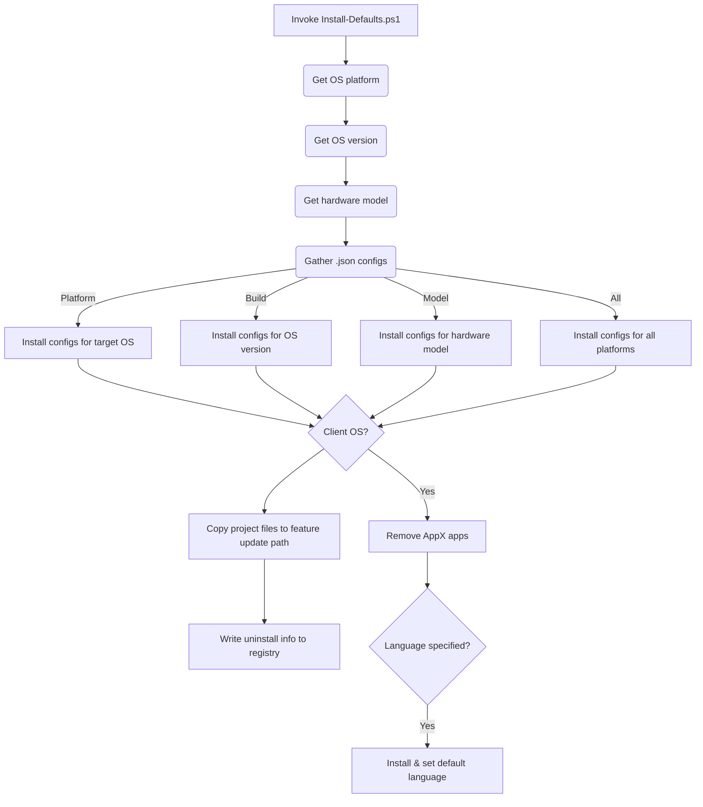

Configuration changes are implemented with `Install-Defaults.ps1`. This script reads configurations in JSON format and configures the local Windows instance with Windows feature states, registry settings, copies files into specified paths, imports a default Start menu, and modifies the default user profile.

Configurations are stored in the following JSON files with the logic to make changes to Windows includes in `Install-Defaults.ps1`:

* [Build.All.json](https://github.com/aaronparker/defaults/blob/main/src/Build.All.json)
* [Machine-Windows11.All.json](https://github.com/aaronparker/defaults/blob/main/src/Machine-Windows11.All.json)
* [Machine.All.json](https://github.com/aaronparker/defaults/blob/main/src/Machine.All.json)
* [Machine.Client.json](https://github.com/aaronparker/defaults/blob/main/src/Machine.Client.json)
* [Machine.Server.json](https://github.com/aaronparker/defaults/blob/main/src/Machine.Server.json)
* [User-Windows10.All.json](https://github.com/aaronparker/defaults/blob/main/src/User-Windows10.All.json)
* [User-Windows11.All.json](https://github.com/aaronparker/defaults/blob/main/src/User-Windows11.All.json)
* [User.All.json](https://github.com/aaronparker/defaults/blob/main/src/User.All.json)
* [User.Client.json](https://github.com/aaronparker/defaults/blob/main/src/User.Client.json)
* [User.Server.json](https://github.com/aaronparker/defaults/blob/main/src/User.Machine.json)
* [User.Virtual.json](https://github.com/aaronparker/defaults/blob/main/src/User.Virtual.json)

JSON files are gathered based on properties of the local Windows instance. The following keywords, used in the file names, ensure that the right JSON files are selected:

* `Client` - Windows 10 or Windows 11
* `Server` - Windows Server 2016, 2019, 2022, 2025 etc.
* `Virtual` - Virtual machines, e.g. Hyper-V, Azure, vSphere, Parallels etc.
* `All` - applies to all Windows install types

Each JSON file includes a `MinimumBuild` property that can be used to ensure specific configurations only apply to a specific version of Windows or above. For example, the property might ensure that configurations only apply to Windows 10 version `10.0.19041` and above.

## Other Configurations

`Install-Defaults.ps1` performs additional tasks not defined in the JSON configuration files:

* Removes inbox Universal Windows Platform (AppX) apps - see [Remove UWP apps](https://stealthpuppy.com/defaults/appxapps/)
* Copies the solution as a [Run custom actions during feature update](https://learn.microsoft.com/en-gb/windows-hardware/manufacture/desktop/windows-setup-enable-custom-actions?view=windows-11). This enables the Custom Defaults to be re-run during an in-place upgrade

## Script Process Visualisation

Here's an visualisation of how the `Install-Defaults.ps1` works:

