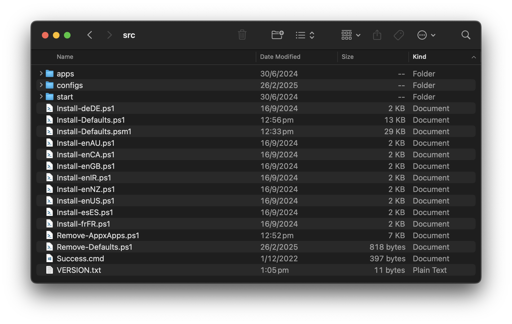

To customise the solution, download the [latest release](https://github.com/aaronparker/image-customise/releases) in `.zip` format and extract the archive. You should then see a folder listing similar to the following.



In most cases, you may want to customise the default Start menu; however, you may also have a requirement to add or remove registry settings.

## Registry settings

Registry settings should be laid out in the following format:

```json
{
    "MinimumBuild": "10.0.14393",
    "Registry": {
        "Type": "DefaultProfile",
        "Set": [
            {
                "path": "HKCU:\\Software\\Microsoft\\TabletTip\\1.7",
                "name": "TipbandDesiredVisibility",
                "value": 0,
                "type": "DWord"
            }
        ]
    }
}
```

Settings and values that can be used here are:

* `MinimumBuild` - used to ensure that the specified registry settings are only implemented if the Windows instance is equal to or greater than the specified version number
* `Registry` - a required property
* `Type` - this property supports `DefaultProfile` or `Direct`, tell the solution to implement the array of registry entries listed in `Set` to be applied directly against the path specified or the the default profile
* `Set` - tells the solution to set the array of registry entries

Each registry entry must include `path`, `name`, `value` and `type`. The Type property are registry entry types that are expected by [`Set-ItemProperty`](https://docs.microsoft.com/en-us/powershell/scripting/samples/working-with-registry-entries).

## Registry paths

Registry paths can be specified with `HKLM:` or `HKCU:`. Registry entries with paths in `HKLM` should not be included with the `Type` property set to `DefaultProfile`.

## Files and Folders

The solution supports the removal of target directories and coping of files into a target directory.

```json
{
    "MinimumBuild": "10.0.14393",
    "Paths": {
        "Remove": [
            "C:\\Users\\Public\\Music\\Sample Music",
            "C:\\Users\\Public\\Pictures\\Sample Pictures",
            "C:\\Users\\Public\\Videos\\Sample Videos",
            "C:\\Users\\Public\\Recorded TV\\Sample Media",
            "C:\\Logs"
        ],
        "Copy": [
            {
                "Source": "desktop-config.json",
                "Destination": "C:\\Users\\Default\\AppData\\Roaming\\Microsoft\\Teams"
            }
        ]
    }
}
```

Settings and values that can be used here are:

* `MinimumBuild` - used to ensure that the specified file or folder actions are only implemented if the Windows instance is equal to or greater than the specified version number
* `Remove` - specified an array of paths to remove from the image if the path exists
* `Copy` - specifies an array of source and destination paths. The source must be located within the solution's source directory.

## Enabling Services

The solution can enable services if a dependent feature exists. For example, the following snippet will enable the Windows Audio and Windows Search services if the Remote Desktop Session Host feature exists.

```json
{
    "MinimumBuild": "10.0.14393",
    "Services": {
        "Feature": "RDS-RD-Server",
        "Enable": [
            "Audiosrv",
            "WSearch"
        ]
    }
}
```

## Windows Features

Windows feature states can be configured using the following JSON:

```json
{
    "MinimumBuild": "10.0.14393",
    "Features": {
        "Disable": [
            "Printing-XPSServices-Features",
            "SMB1Protocol",
            "WorkFolders-Client",
            "FaxServicesClientPackage",
            "WindowsMediaPlayer"
        ]
    },
    "Capabilities": {
        "Remove": [
            "App.Support.QuickAssist~~~~0.0.1.0",
            "Media.WindowsMediaPlayer~~~~0.0.12.0",
            "XPS.Viewer~~~~0.0.1.0"
        ],
    },
    "Packages": {
        "Remove": [
            "Microsoft-Windows-MediaPlayer-Package*"
        ]
    }
}
```

* `MinimumBuild` - used to ensure that the specified file or folder actions are only implemented if the Windows instance is equal to or greater than the specified version number
* `Features / Disable` - disables Windows features. Accepts feature names retrieved with `Get-WindowsOptionalFeature -Online`
* `Capabilities / Remove` - removes Windows capabilities. Accepts capability names retrieved with `Get-WindowsCapability -Online`
* `Packages / Remove` - removes Windows packages. Accepts package names retrieved with `Get-WindowsPackage -Online`

## Start menu and Taskbar

Importing a default Start menu is implemented with the following JSON; however, note that there are differences between client and server versions of Windows.

For Windows 10 or Windows 11, the Start menu layout to import, is specified with the `Windows10` or `Windows11` property; while for Windows Server, the Start menu layout is specified by the presence or not of a specified Windows feature - in the example below a specific layout is imported is the Remote Desktop Session Host role is installed.

=== "Client"

    ```json
    {
        "MinimumBuild": "10.0.14393",
        "StartMenu": {
            "Type": "Client",
            "Feature": "",
            "Windows10": [
                {
                    "Source": "Windows10StartMenuLayout.xml",
                    "Destination": "C:\\Users\\Default\\AppData\\Local\\Microsoft\\Windows\\Shell\\LayoutModification.xml"
                }
            ],
            "Windows11": [
                {
                    "Source": "Windows11StartMenuLayout.json",
                    "Destination": "C:\\Users\\Default\\AppData\\Local\\Microsoft\\Windows\\Shell\\LayoutModification.json"
                },
                {
                    "Source": "Windows11TaskbarLayout.xml",
                    "Destination": "C:\\Users\\Default\\AppData\\Local\\Microsoft\\Windows\\Shell\\LayoutModification.xml"
                },
                {
                    "Source": "Windows11Start.bin",
                    "Destination": "C:\\Users\\Default\\AppData\\Local\\Packages\\Microsoft.Windows.StartMenuExperienceHost_cw5n1h2txyewy\\LocalState\\start2.bin"
                }
            ]
        }
    }
    ```

=== "Server"

    ```json
    {
        "StartMenu": {
            "Type": "Server",
            "Feature": "RDS-RD-Server",
            "Exists": [
                {
                    "Source": "WindowsRDSStartMenuLayout.xml",
                    "Destination": "C:\\Users\\Default\\AppData\\Local\\Microsoft\\Windows\\Shell\\LayoutModification.xml"
                }
            ],
            "NotExists": [
                {
                    "Source": "WindowsServerStartMenuLayout.xml",
                    "Destination": "C:\\Users\\Default\\AppData\\Local\\Microsoft\\Windows\\Shell\\LayoutModification.xml"
                }
            ]
        }
    }
    ```

### Windows 11 Start menu

Importing a customised default Start menu for Windows 10 and current versions of Windows Server works by importing [LayoutModification.xml](https://docs.microsoft.com/en-us/windows/configuration/customize-and-export-start-layout); however this process is [changed considerably for Windows 11](https://docs.microsoft.com/en-us/windows/configuration/customize-start-menu-layout-windows-11) and it does not provide you full control over the default layout, particularly the pinned shortcuts.

For example, you won't be able to remove the Microsoft Store shortcut from the Windows 11 Start menu. Therefore, if you want a full customised default Start menu, another approach is required.

The use of `LayoutModification.json` and `LayoutModification.xml` to customise the Start menu and the Taskbar respectively can be used; however, to fully customise all shortcuts pinned to the Windows 11 Start menu, the StartMenuExperienceHost persistent state (`start.bin`) must be copied from a source machine. The file is found in `%LocalAppData%\Packages\Microsoft.Windows.StartMenuExperienceHost_cw5n1h2txyewy\LocalState`.

The solution includes a persistent state file - `Windows11Start.bin`, in addition to `LayoutModification.json` and `LayoutModification.xml`. These will all be copied into the appropriate destination as specified in the JSON:

```json
"Windows11": [
    {
        "Source": "Windows11StartMenuLayout.json",
        "Destination": "C:\\Users\\Default\\AppData\\Local\\Microsoft\\Windows\\Shell\\LayoutModification.json"
    },
    {
        "Source": "Windows11TaskbarLayout.xml",
        "Destination": "C:\\Users\\Default\\AppData\\Local\\Microsoft\\Windows\\Shell\\LayoutModification.xml"
    },
    {
        "Source": "Windows11Start.bin",
        "Destination": "C:\\Users\\Default\\AppData\\Local\\Packages\\Microsoft.Windows.StartMenuExperienceHost_cw5n1h2txyewy\\LocalState\\start2.bin"
    }
]
```
