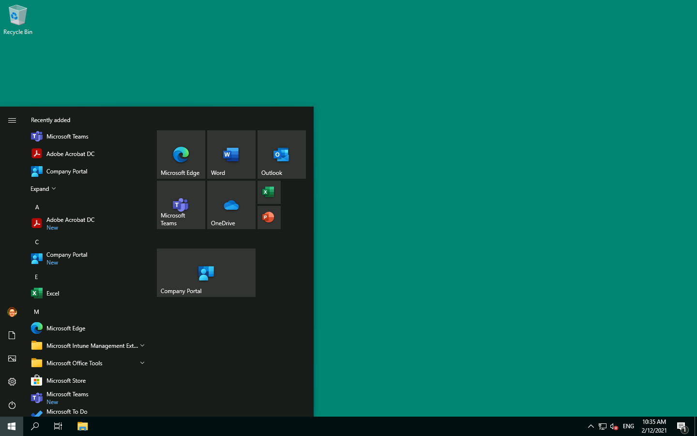
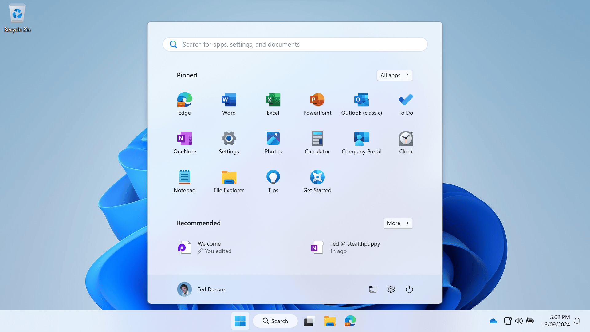

Windows Customised Defaults is a solution for customising a Windows image to change the settings from the Microsoft defaults to something more enterprise ready. The solution will update the Windows default profile, including configuring the default Start menu, and configure Windows feature states.

Windows Customised Defaults supports Windows 10, Windows 11, Windows Server 2016, Windows Server 2019 and Windows Server 2022, and supports both physical PCs and virtual machine images. Aimed at deployment provisioning physical PCs or virtual desktops gold images, the customisations will also work for Windows Server infrastructure roles.

## Usage

The customisations are intended for operating system deployment via various methods, including:

* Imported into the Microsoft Deployment Toolkit as an application for use during Lite Touch deployments - [Create a New Application in the Deployment Workbench](https://docs.microsoft.com/en-us/mem/configmgr/mdt/use-the-mdt#CreateaNewApplicationintheDeploymentWorkbench)
* Imported into Configuration Manager for use during Zero Touch deployments: - [Create applications in Configuration Manager](https://docs.microsoft.com/en-us/mem/configmgr/apps/deploy-use/create-applications)
* Packaged as a Win32 application and delivered via Microsoft Intune during Windows Autopilot - [Win32 app management in Microsoft Intune](https://docs.microsoft.com/en-us/mem/intune/apps/apps-win32-app-management)
* Executed in a virtual machine image pipeline using [Azure Image Builder](https://docs.microsoft.com/en-us/azure/virtual-machines/image-builder-overview) or [Packer](https://www.packer.io/)
* Or even run manually on a virtual machine gold image if you're not using automation at all

## Results

This package will configure the Windows image ready for enterprise and and for the end-user. For Windows 10 (and Windows Server as a virtual desktop), the user should see that their default Start menu, taskbar, and desktop should be similar to the screenshot below:

For Windows 11, the Start menu, taskbar, and desktop right after first sign-in, should look like to this:

## Supported Platforms

The scripts are tested on Windows 10 (1809 and above), Windows 11, Windows Server 2016, Windows Server 2019, and Windows Server 2022. All scripts should work on any future versions of Windows as well; however, testing before rolling out in production is recommended.

!!! note ""

    Windows PowerShell only is supported - typically during operating system deployments, there should be no strict requirement for PowerShell 6 or above. While the scripts will likely work OK on PowerShell 6+, they are not actively tested on those versions.

---
[Laptop Settings](https://icons8.com/icon/iSNxtIhB8C9B/laptop-settings) by [Icons8](https://icons8.com).
