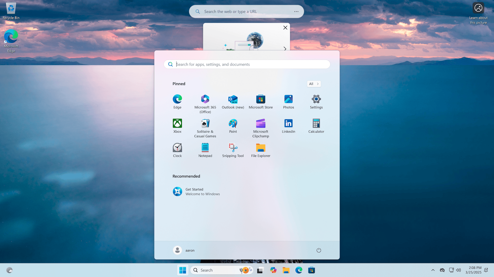
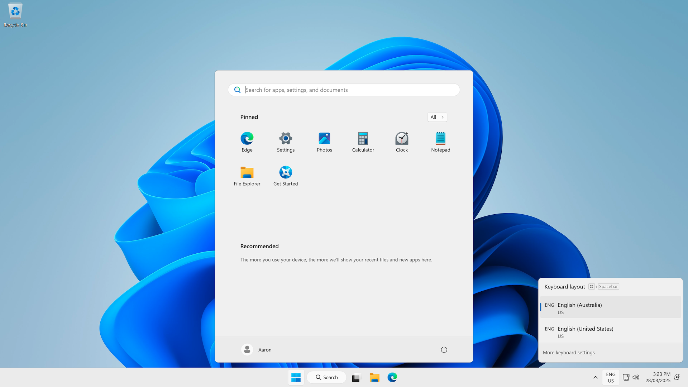

Windows Enterprise Defaults is a solution for customising a Windows image to modify the Microsoft defaults and make Windows enterprise ready. Microsoft's defaults suit the lowest common denominator for home, small business and enterprises, but an enterprise-ready Windows desktop requires some adjustments to the Windows and the default user environment.

Windows Enterprise Defaults simplifies those changes to Windows, including - updating the Windows default profile, including the default Start menu and taskbar, the Windows user environment and Explorer settings, Windows capability and feature states, and removes in-box application packages. Windows Enterprise Defaults is not a "de-bloater", while it makes changes to Windows including removing in-box applications, the approach is to make sensible changes to Windows without crippling the end-user experience.

Windows 10, Windows 11, and Windows Server 2016 to Windows Server 2025 are supported, both on physical PCs and virtual machine images (Azure Virtual Desktop, Windows 365 etc.). Windows Enterprise Defaults is primarily aimed at provisioning physical PCs or virtual desktops gold images, but will also work for Windows Server infrastructure roles.

## Usage

The solution is intended for operating system deployment via various methods, including:

* Imported into the Microsoft Deployment Toolkit as an application for use during Lite Touch deployments - [Create a New Application in the Deployment Workbench](https://docs.microsoft.com/en-us/mem/configmgr/mdt/use-the-mdt#CreateaNewApplicationintheDeploymentWorkbench)
* Imported into Configuration Manager for use during Zero Touch deployments: - [Create applications in Configuration Manager](https://docs.microsoft.com/en-us/mem/configmgr/apps/deploy-use/create-applications)
* Packaged as a Win32 application and delivered via Microsoft Intune during Windows Autopilot - [Win32 app management in Microsoft Intune](https://docs.microsoft.com/en-us/mem/intune/apps/apps-win32-app-management)
* Executed in a virtual machine image pipeline using [Azure Image Builder](https://docs.microsoft.com/en-us/azure/virtual-machines/image-builder-overview) or [Packer](https://www.packer.io/) when building a gold image
* Or even run manually on a Windows PC or virtual machine gold image if you're not using automation at all

## Results

This package will configure the Windows image ready for the enterprise and the end-user. Here's the default Windows 11 desktop:

And here's a Windows 11 desktop after customisation - note that regional settings are configured, there's default Start menu, the search box in the taskbar has been reduced in size, many of the in-box applications have been uninstalled, and the default wallpaper has been set back to the Windows 11 bloom wallpaper (instead of Windows spotlight).

## Supported Platforms

The solution has been tested on Windows 10 (1809 and above), Windows 11, Windows Server 2016-2025. All scripts should work on any future versions of Windows; however, you should test thoroughly before deployment in production.

!!! note ""

    Windows PowerShell only is supported - typically during operating system deployments, there should be no strict requirement for PowerShell 6 or above. While the solution should work OK on PowerShell 6+, no testing is done on those versions.

---
[Laptop Settings](https://icons8.com/icon/iSNxtIhB8C9B/laptop-settings) by [Icons8](https://icons8.com).
