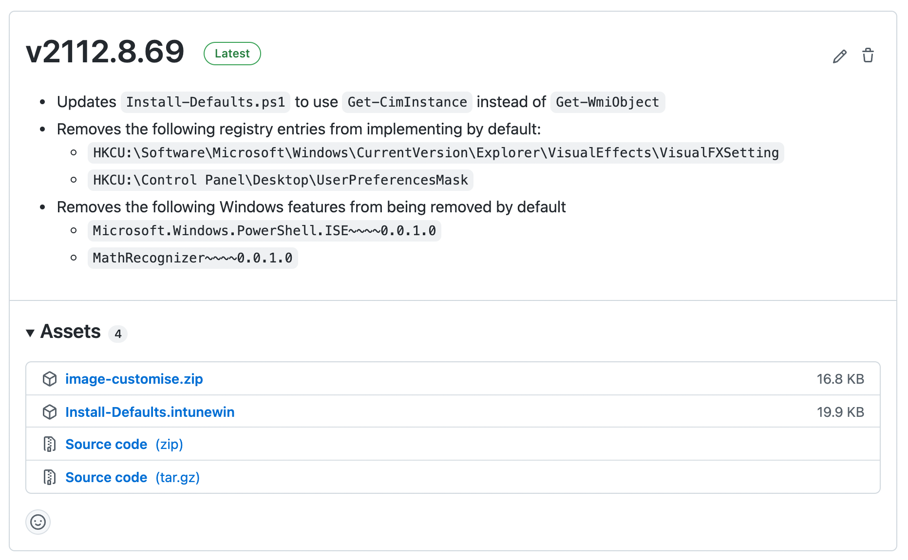

## Download the Latest Release

To use the scripts in an operating system deployment pipeline, download the zip file (`image-customise.zip`) attached to the [latest release](https://github.com/aaronparker/image-customise/releases/latest) and import the extracted files into your OS deployment solution (e.g., the Microsoft Deployment Toolkit, Microsoft Endpoint Configuration Manager, etc.).



## Install and Detection

Installation of the Windows Customised Defaults is handled by `Install-Defaults.ps1`. When using a deployment tool such as MDT, ConfigMgr or Intune, use the following command for install:

```powershell
C:\Windows\System32\WindowsPowerShell\v1.0\powershell.exe -ExecutionPolicy RemoteSigned -File .\Install-Defaults.ps1
```

Once installed, the following registry information can be used to detect that the package is installed:

* Key - `HKEY_LOCAL_MACHINE\SOFTWARE\Microsoft\Windows\CurrentVersion\Uninstall\f38de27b-799e-4c30-8a01-bfdedc622944`
* Value - `DisplayVersion`
* Data - `2201.27.82` (the version number of the current release)

### Microsoft Intune

The solution is also provided in `.intunewin` format to enable direct import into Microsoft Intune without re-packaging.

Settings for importing the Windows Customised Defaults as a Win32 package into Intune are maintained here: [App.json](https://github.com/aaronparker/image-customise/blob/main/App.json). This can be used with the [IntuneWin32AppPackager](https://github.com/MSEndpointMgr/IntuneWin32AppPackager) to automate import into Intune.


## Download and Install

To simplify download and install during an automated image build pipeline, or to install manually into an image, a [quick install script](https://raw.githubusercontent.com/aaronparker/image-customise/main/Install.ps1) is provided that can be executed with the following PowerShell:

```powershell
Set-ExecutionPolicy Bypass -Scope Process -Force;
[System.Net.ServicePointManager]::SecurityProtocol = [System.Net.ServicePointManager]::SecurityProtocol -bor 3072;
Invoke-Expression ((New-Object System.Net.WebClient).DownloadString("https://raw.githubusercontent.com/aaronparker/image-customise/main/Install.ps1"))
```

This will download the latest release in zip format, extract the archive and execute `Install-Defaults.ps1` on the local Windows instance, to install the Windows Customised Defaults.
