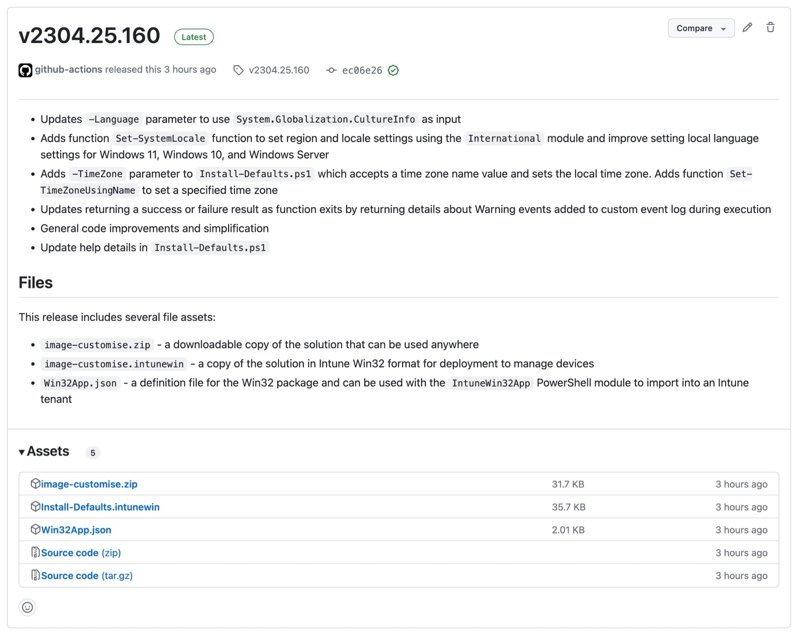
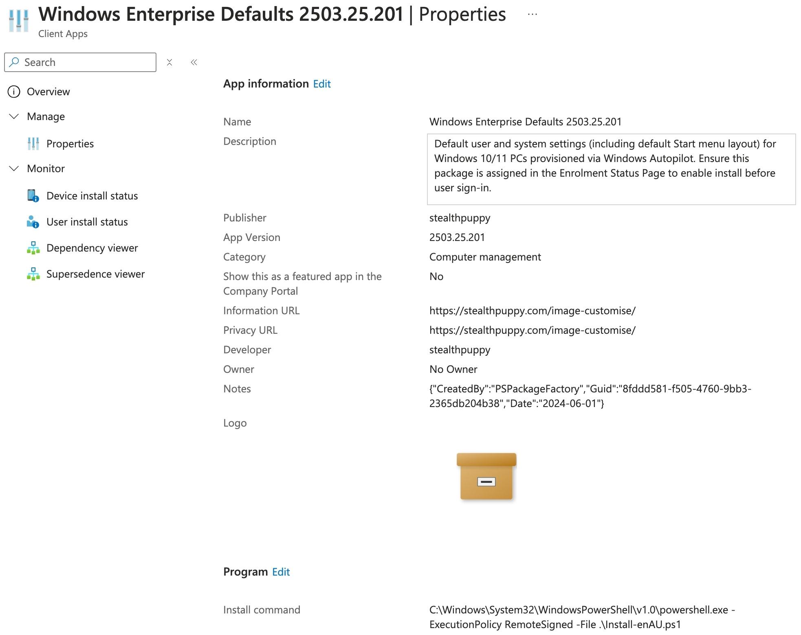

## Download the Latest Release

To use the scripts in an operating system deployment pipeline, download the zip file (`image-customise.zip`) attached to the [latest release](https://github.com/aaronparker/image-customise/releases/latest) and import the extracted files into your OS deployment solution (e.g., the Microsoft Deployment Toolkit, Microsoft Intune, Microsoft Configuration Manager, etc.).



## Install

Installation of the Windows Customised Defaults is handled by `Install-Defaults.ps1`. When using a deployment tool such as MDT, ConfigMgr or Intune, use the following command for install:

```powershell
C:\Windows\System32\WindowsPowerShell\v1.0\powershell.exe -ExecutionPolicy RemoteSigned -File .\Install-Defaults.ps1
```

### Localising Windows

`Install-Defaults.ps1` can install language packs and configure system-wide language / locale settings on Windows 10 and Windows 11, for example:

```powershell
.\Install-Defaults.ps1 -Language "en-AU"
```

Use `Install-Defaults.ps1 -Language "<language code>"` to install a language pack and set local settings for a specified language. This parameter supports the **bcp47** tag of the language to install (e.g., `en-AU`, `en-GB`, `fr-FR`). No locale, regional settings or language packs will be installed unless this parameter is specified.

This uses the [Install-Language](https://learn.microsoft.com/en-au/powershell/module/languagepackmanagement/install-language) module to install the appropriate language pack. This module is only available on current version of Windows 10 and Windows 11 - installation of a language pack on Windows Server is not yet supported.

!!! note

    Installation of a language pack on Windows 10 requires a reboot.

Additional locale settings can be configured for any version of Windows 10, Windows 11 and Windows Server 2016+ with the `International` PowerShell module. `Install-Defaults.ps1` will also configure culture, locale, and language settings using the language value specified in `-Language`.

Below is a summary of the commands used to configure these settings:

```powershell
[System.Globalization.CultureInfo] $Language = "en-AU"
Import-Module -Name "International"
Set-Culture -CultureInfo $Language
Set-WinSystemLocale -SystemLocale $Language
Set-WinUILanguageOverride -Language $Language
Set-WinUserLanguageList -LanguageList $Language.Name -Force
$RegionInfo = New-Object -TypeName "System.Globalization.RegionInfo" -ArgumentList $Language
Set-WinHomeLocation -GeoId $RegionInfo.GeoId
Set-SystemPreferredUILanguage -Language $Language
```

### Set a Time Zone

For Windows 10 and Windows 11, the solution will enable location settings for physical PCs that will automatically se the time zone in most scenarios. However, `Install-Defaults.ps1` can directly set a time zone when specified on the `-TimeZone` parameter. Use `Install-Defaults.ps1 -TimeZone "Time zone name"` to set the required time zone.

To view the list of valid time zone names to pass to this parameter, use `Get-TimeZone -ListAvailable`, and use the time zone name on the `Id` property. Localising Windows and setting the appropriate time zone would look like this:

```powershell
.\Install-Defaults.ps1 -Language "en-AU" -TimeZone "AUS Eastern Standard Time"
```

## Detection

Once installed, the following registry information can be used to detect that the package is installed:

* Key - `HKEY_LOCAL_MACHINE\SOFTWARE\Microsoft\Windows\CurrentVersion\Uninstall\{f38de27b-799e-4c30-8a01-bfdedc622944}`
* Value - `DisplayVersion`
* Data - `2211.29.129` (the version number of the current release)

### Microsoft Intune

The solution is also provided in `.intunewin` format to enable direct import into Microsoft Intune without re-packaging.

Settings for importing the Windows Customised Defaults as a Win32 package into Intune are maintained here: [App.json](https://github.com/aaronparker/image-customise/blob/main/App.json). This can be used with the [IntuneWin32AppPackager](https://github.com/MSEndpointMgr/IntuneWin32AppPackager) to automate import into Intune.



!!! note ""

    To enable support for multiple languages, create multiple Win32 applications with different command lines - one for each required language.

## Download and Install

To simplify download and install during an automated image build pipeline, or to install manually into an image, a [quick install script](https://raw.githubusercontent.com/aaronparker/image-customise/main/Install.ps1) is provided that can be executed with the following PowerShell:

```powershell
Set-ExecutionPolicy Bypass -Scope Process -Force;
[System.Net.ServicePointManager]::SecurityProtocol = [System.Net.ServicePointManager]::SecurityProtocol -bor 3072;
Invoke-Expression ((New-Object System.Net.WebClient).DownloadString("https://raw.githubusercontent.com/aaronparker/image-customise/main/Install.ps1"))
```

This will download the latest release in zip format, extract the archive and execute `Install-Defaults.ps1` on the local Windows instance, to install the Windows Customised Defaults.
