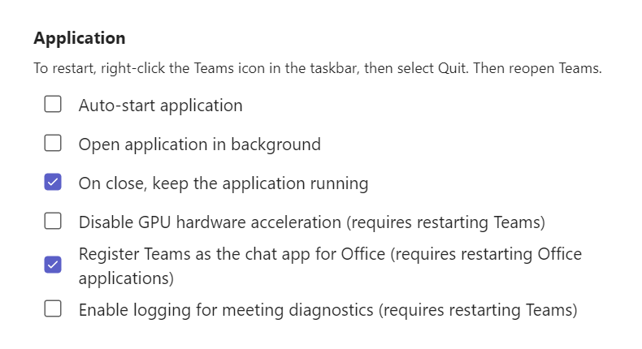

## Microsoft Teams

Microsoft Teams defaults defined in [`desktop-config.json`](https://github.com/aaronparker/image-customise/blob/main/src/desktop-config.json) don't take effect as intended.

The intention is to configure Teams before first sign-in, including preventing automatic launch and setting application language.

Teams will launch on first sign-in; however it will not launch automatically on subsequent sign-ins.



Additionally, the language still defaults to English (United States).


If you would prefer the default behaviour of Microsoft Teams, remove the following option from the JSON:

```json
"Files": {
    "Copy": [
        {
            "Source": "desktop-config.json",
            "Destination": "C:\\Users\\Default\\AppData\\Roaming\\Microsoft\\Teams\\desktop-config.json"
        }
    ]
}
```
