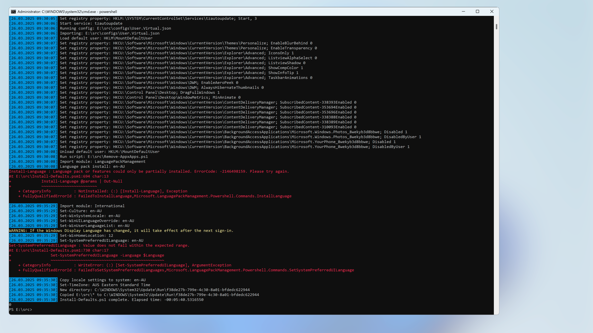

## Windows 11 Taskbar cannot be customised

Direct customisation of the Windows 11 taskbar isn't possible without sysprepping the image. This means that the taskbar layout for Windows PCs or other static machines customised with this solution, won't have the taskbar customised. It should work on gold images for virtual desktops that are sysprepped after being customised.

See [Customize the Taskbar](https://learn.microsoft.com/en-us/windows-hardware/customize/desktop/customize-the-windows-11-taskbar) for details on the steps required to customise the Windows 11 taskbar.

## Language pack installs require Windows updates

When using `Install-Defaults.ps1` to install a language pack, the following errors may be encountered:

```powershell
Install-Language : Language pack or features could only be partially installed. ErrorCode: -2146498159. Please try again.
```

and:

```powershell
Set-SystemPreferredUILanguage : Value does not fall within the expected range.
```

This occurs even when using a Windows 11 24H2 install from an ISO with recent updates integrated, so this will be difficult to address in Windows Autopilot deployments. When provisioning Windows via Autopilot, deploy language packs (LXPs) directly as an application from Intune.

For gold images, ensure the latest Windows Updates are installed before installing the solution.

The screenshot below shows this issue when manually running the solution in [Windows OOBE](https://learn.microsoft.com/en-us/windows-hardware/customize/desktop/customize-oobe-in-windows-11).


