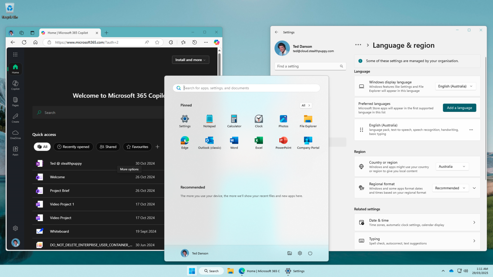
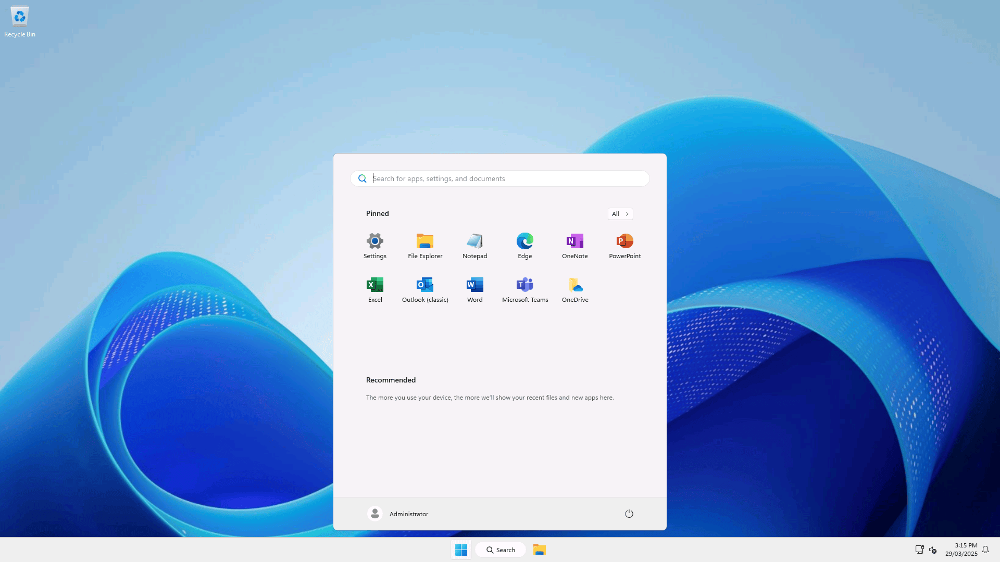

Windows Enterprise Defaults will configure the Windows image ready for the enterprise and an improved end-user experience.

Here's the default Windows 11 desktop with many of the in-box applications pinned to the Start menu, Windows spotlight set as the default wallpaper, Microsoft Edge web search box on the desktop, and Microsoft Copilot and the Microsoft Store pinned to the taskbar.

And here's a Windows 11 desktop after customisation - note that regional settings are configured, there's default Start menu, the search box in the taskbar has been reduced in size, many of the in-box applications have been uninstalled, and the default wallpaper has been set back to the Windows 11 bloom wallpaper (instead of Windows spotlight).

When used in provisioning devices with Windows Autopilot, other deployment tools, or with a VDI solution or Windows 365, and combined with Intune policies or Group Policy settings, the default user desktop should then be similar to the following screenshot.

Windows Enterprise Defaults also supports Windows Server Remote Desktop session hosts - here's the default desktop on Windows Server 2025 after customisation.

